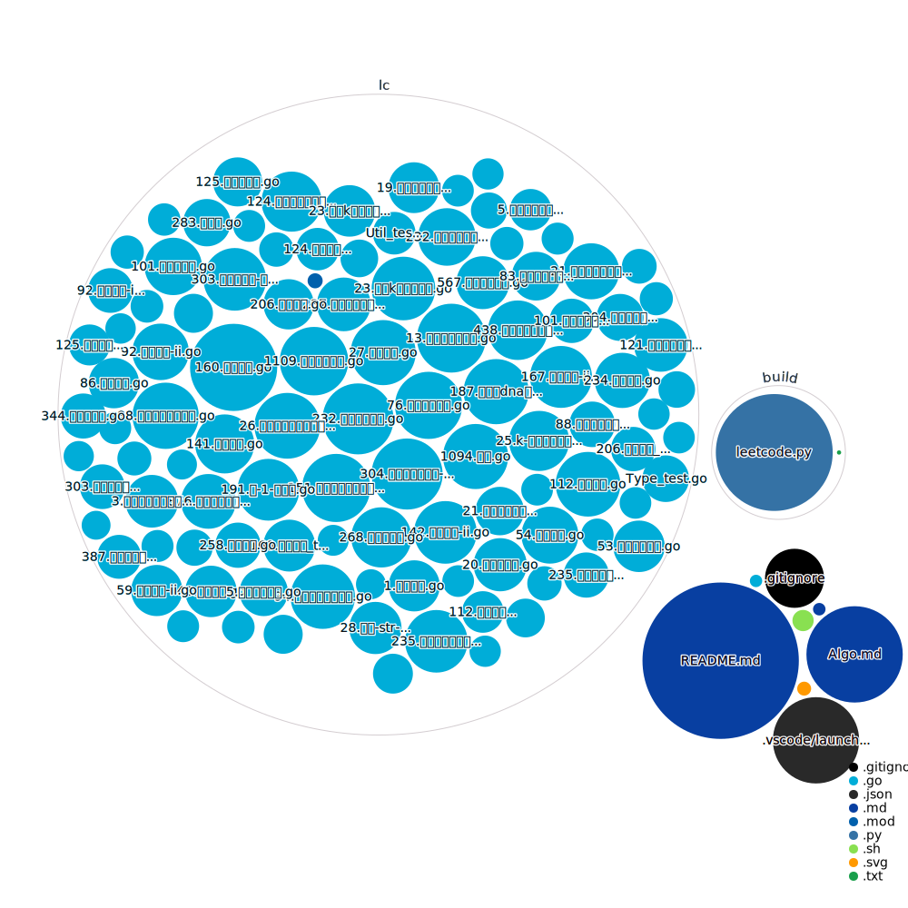

# leetcode-golang

```go
package main

import "fmt"

func main() {
  fmt.Println("Hello, leetcode")
}
```

# 文件结构

# 算法框架
See [Algo Overview](Algo.md)
# 提交总览
| 编号 | 题目 | 解法 | 题目难度 | 提交次数| 重刷次数 |
| --- | --- | --- | --- | --- | --- |
|1|[#1 两数之和](https://leetcode.cn/problems/two-sum)|[1.两数之和.go](leetcode/lc1/1.两数之和.go)|EASY|2|**2**|
|2|[#2 两数相加](https://leetcode.cn/problems/add-two-numbers)|[2.两数相加.go](leetcode/lc2/2.两数相加.go)|MEDIUM|1|1|
|3|[#3 无重复字符的最长子串](https://leetcode.cn/problems/longest-substring-without-repeating-characters)|[3.无重复字符的最长子串.go](leetcode/lc3/3.无重复字符的最长子串.go)|MEDIUM|1|1|
|4|[#4 寻找两个正序数组的中位数](https://leetcode.cn/problems/median-of-two-sorted-arrays)|[4.寻找两个正序数组的中位数.go](leetcode/lc4/4.寻找两个正序数组的中位数.go)|HARD|7|1|
|5|[#5 最长回文子串](https://leetcode.cn/problems/longest-palindromic-substring)|[5.最长回文子串.go](leetcode/lc5/5.最长回文子串.go)|MEDIUM|1|1|
|6|[#6 N 字形变换](https://leetcode.cn/problems/zigzag-conversion)|[6.n-字形变换.go](leetcode/lc6/6.n-字形变换.go)|MEDIUM|4|1|
|7|[#7 整数反转](https://leetcode.cn/problems/reverse-integer)||MEDIUM|3|1|
|8|[#8 字符串转换整数 (atoi)](https://leetcode.cn/problems/string-to-integer-atoi)|[8.字符串转换整数-atoi.go](leetcode/lc8/8.字符串转换整数-atoi.go)|MEDIUM|4|1|
|9|[#10 正则表达式匹配](https://leetcode.cn/problems/regular-expression-matching)|[10.正则表达式匹配.go](leetcode/lc10/10.正则表达式匹配.go)|HARD|2|1|
|10|[#11 盛最多水的容器](https://leetcode.cn/problems/container-with-most-water)|[11.盛最多水的容器.go](leetcode/lc11/11.盛最多水的容器.go)|MEDIUM|1|1|
|11|[#13 罗马数字转整数](https://leetcode.cn/problems/roman-to-integer)|[13.罗马数字转整数.go](leetcode/lc13/13.罗马数字转整数.go)|EASY|1|1|
|12|[#15 三数之和](https://leetcode.cn/problems/3sum)|[15.三数之和.go](leetcode/lc15/15.三数之和.go)|MEDIUM|2|1|
|13|[#17 电话号码的字母组合](https://leetcode.cn/problems/letter-combinations-of-a-phone-number)|[17.电话号码的字母组合.go](leetcode/lc17/17.电话号码的字母组合.go)|MEDIUM|1|1|
|14|[#19 删除链表的倒数第 N 个结点](https://leetcode.cn/problems/remove-nth-node-from-end-of-list)|[19.删除链表的倒数第-n-个结点.go](leetcode/lc19/19.删除链表的倒数第-n-个结点.go)|MEDIUM|11|1|
|15|[#20 有效的括号](https://leetcode.cn/problems/valid-parentheses)|[20.有效的括号.go](leetcode/lc20/20.有效的括号.go)|EASY|2|1|
|16|[#21 合并两个有序链表](https://leetcode.cn/problems/merge-two-sorted-lists)|[21.合并两个有序链表.go](leetcode/lc21/21.合并两个有序链表.go)|EASY|4|1|
|17|[#22 括号生成](https://leetcode.cn/problems/generate-parentheses)|[22.括号生成.go](leetcode/lc22/22.括号生成.go)|MEDIUM|1|1|
|18|[#23 合并 K 个升序链表](https://leetcode.cn/problems/merge-k-sorted-lists)|[23.合并k个升序链表.go](leetcode/lc23/23.合并k个升序链表.go)|HARD|2|1|
|19|[#25 K 个一组翻转链表](https://leetcode.cn/problems/reverse-nodes-in-k-group)|[25.k-个一组翻转链表.go](leetcode/lc25/25.k-个一组翻转链表.go)|HARD|1|1|
|20|[#26 删除有序数组中的重复项](https://leetcode.cn/problems/remove-duplicates-from-sorted-array)|[26.删除有序数组中的重复项.go](leetcode/lc26/26.删除有序数组中的重复项.go)|EASY|4|1|
|21|[#27 移除元素](https://leetcode.cn/problems/remove-element)|[27.移除元素.go](leetcode/lc27/27.移除元素.go)|EASY|1|1|
|22|[#28 找出字符串中第一个匹配项的下标](https://leetcode.cn/problems/find-the-index-of-the-first-occurrence-in-a-string)|[28.找出字符串中第一个匹配项的下标.go](leetcode/lc28/28.找出字符串中第一个匹配项的下标.go)|EASY|5|**2**|
|23|[#34 在排序数组中查找元素的第一个和最后一个位置](https://leetcode.cn/problems/find-first-and-last-position-of-element-in-sorted-array)|[34.在排序数组中查找元素的第一个和最后一个位置.go](leetcode/lc34/34.在排序数组中查找元素的第一个和最后一个位置.go)|MEDIUM|2|1|
|24|[#37 解数独](https://leetcode.cn/problems/sudoku-solver)|[37.解数独.go](leetcode/lc37/37.解数独.go)|HARD|1|1|
|25|[#39 组合总和](https://leetcode.cn/problems/combination-sum)|[39.组合总和.go](leetcode/lc39/39.组合总和.go)|MEDIUM|3|1|
|26|[#40 组合总和 II](https://leetcode.cn/problems/combination-sum-ii)|[40.组合总和-ii.go](leetcode/lc40/40.组合总和-ii.go)|MEDIUM|1|1|
|27|[#45 跳跃游戏 II](https://leetcode.cn/problems/jump-game-ii)|[45.跳跃游戏-ii.go](leetcode/lc45/45.跳跃游戏-ii.go)|MEDIUM|4|1|
|28|[#46 全排列](https://leetcode.cn/problems/permutations)|[46.全排列.go](leetcode/lc46/46.全排列.go)|MEDIUM|1|1|
|29|[#47 全排列 II](https://leetcode.cn/problems/permutations-ii)|[47.全排列-ii.go](leetcode/lc47/47.全排列-ii.go)|MEDIUM|4|1|
|30|[#48 旋转图像](https://leetcode.cn/problems/rotate-image)|[48.旋转图像.go](leetcode/lc48/48.旋转图像.go)|MEDIUM|1|1|
|31|[#51 N 皇后](https://leetcode.cn/problems/n-queens)|[51.n-皇后.go](leetcode/lc51/51.n-皇后.go)|HARD|3|1|
|32|[#53 最大子数组和](https://leetcode.cn/problems/maximum-subarray)|[53.最大子数组和.go](leetcode/lc53/53.最大子数组和.go)|MEDIUM|3|**2**|
|33|[#54 螺旋矩阵](https://leetcode.cn/problems/spiral-matrix)|[54.螺旋矩阵.go](leetcode/lc54/54.螺旋矩阵.go)|MEDIUM|3|1|
|34|[#55 跳跃游戏](https://leetcode.cn/problems/jump-game)|[55.跳跃游戏.go](leetcode/lc55/55.跳跃游戏.go)|MEDIUM|1|1|
|35|[#59 螺旋矩阵 II](https://leetcode.cn/problems/spiral-matrix-ii)|[59.螺旋矩阵-ii.go](leetcode/lc59/59.螺旋矩阵-ii.go)|MEDIUM|5|1|
|36|[#64 最小路径和](https://leetcode.cn/problems/minimum-path-sum)|[64.最小路径和.go](leetcode/lc64/64.最小路径和.go)|MEDIUM|7|**2**|
|37|[#72 编辑距离](https://leetcode.cn/problems/edit-distance)|[72.编辑距离.go](leetcode/lc72/72.编辑距离.go)|HARD|4|1|
|38|[#76 最小覆盖子串](https://leetcode.cn/problems/minimum-window-substring)|[76.最小覆盖子串.go](leetcode/lc76/76.最小覆盖子串.go)|HARD|2|1|
|39|[#77 组合](https://leetcode.cn/problems/combinations)|[77.组合.go](leetcode/lc77/77.组合.go)|MEDIUM|2|1|
|40|[#78 子集](https://leetcode.cn/problems/subsets)|[78.子集.go](leetcode/lc78/78.子集.go)|MEDIUM|1|1|
|41|[#83 删除排序链表中的重复元素](https://leetcode.cn/problems/remove-duplicates-from-sorted-list)|[83.删除排序链表中的重复元素.go](leetcode/lc83/83.删除排序链表中的重复元素.go)|EASY|3|1|
|42|[#86 分隔链表](https://leetcode.cn/problems/partition-list)|[86.分隔链表.go](leetcode/lc86/86.分隔链表.go)|MEDIUM|1|1|
|43|[#88 合并两个有序数组](https://leetcode.cn/problems/merge-sorted-array)|[88.合并两个有序数组.go](leetcode/lc88/88.合并两个有序数组.go)|EASY|3|1|
|44|[#90 子集 II](https://leetcode.cn/problems/subsets-ii)|[90.子集-ii.go](leetcode/lc90/90.子集-ii.go)|MEDIUM|3|1|
|45|[#92 反转链表 II](https://leetcode.cn/problems/reverse-linked-list-ii)|[92.反转链表-ii.go](leetcode/lc92/92.反转链表-ii.go)|MEDIUM|1|1|
|46|[#94 二叉树的中序遍历](https://leetcode.cn/problems/binary-tree-inorder-traversal)|[94.二叉树的中序遍历.go](leetcode/lc94/94.二叉树的中序遍历.go)|EASY|3|1|
|47|[#95 不同的二叉搜索树 II](https://leetcode.cn/problems/unique-binary-search-trees-ii)|[95.不同的二叉搜索树-ii.go](leetcode/lc95/95.不同的二叉搜索树-ii.go)|MEDIUM|3|1|
|48|[#96 不同的二叉搜索树](https://leetcode.cn/problems/unique-binary-search-trees)|[96.不同的二叉搜索树.go](leetcode/lc96/96.不同的二叉搜索树.go)|MEDIUM|2|1|
|49|[#98 验证二叉搜索树](https://leetcode.cn/problems/validate-binary-search-tree)|[98.验证二叉搜索树.go](leetcode/lc98/98.验证二叉搜索树.go)|MEDIUM|2|1|
|50|[#101 对称二叉树](https://leetcode.cn/problems/symmetric-tree)|[101.对称二叉树.go](leetcode/lc101/101.对称二叉树.go)|EASY|3|**2**|
|51|[#104 二叉树的最大深度](https://leetcode.cn/problems/maximum-depth-of-binary-tree)|[104.二叉树的最大深度.go](leetcode/lc104/104.二叉树的最大深度.go)|EASY|1|1|
|52|[#105 从前序与中序遍历序列构造二叉树](https://leetcode.cn/problems/construct-binary-tree-from-preorder-and-inorder-traversal)|[105.从前序与中序遍历序列构造二叉树.go](leetcode/lc105/105.从前序与中序遍历序列构造二叉树.go)|MEDIUM|5|**2**|
|53|[#106 从中序与后序遍历序列构造二叉树](https://leetcode.cn/problems/construct-binary-tree-from-inorder-and-postorder-traversal)|[106.从中序与后序遍历序列构造二叉树.go](leetcode/lc106/106.从中序与后序遍历序列构造二叉树.go)|MEDIUM|2|1|
|54|[#111 二叉树的最小深度](https://leetcode.cn/problems/minimum-depth-of-binary-tree)|[111.二叉树的最小深度.go](leetcode/lc111/111.二叉树的最小深度.go)|EASY|3|1|
|55|[#112 路径总和](https://leetcode.cn/problems/path-sum)|[112.路径总和.go](leetcode/lc112/112.路径总和.go)|EASY|1|1|
|56|[#114 二叉树展开为链表](https://leetcode.cn/problems/flatten-binary-tree-to-linked-list)|[114.二叉树展开为链表.go](leetcode/lc114/114.二叉树展开为链表.go)|MEDIUM|3|1|
|57|[#116 填充每个节点的下一个右侧节点指针](https://leetcode.cn/problems/populating-next-right-pointers-in-each-node)|[116.填充每个节点的下一个右侧节点指针.go](leetcode/lc116/116.填充每个节点的下一个右侧节点指针.go)|MEDIUM|1|1|
|58|[#121 买卖股票的最佳时机](https://leetcode.cn/problems/best-time-to-buy-and-sell-stock)|[121.买卖股票的最佳时机.go](leetcode/lc121/121.买卖股票的最佳时机.go)|EASY|5|**2**|
|59|[#122 买卖股票的最佳时机 II](https://leetcode.cn/problems/best-time-to-buy-and-sell-stock-ii)|[122.买卖股票的最佳时机-ii.go](leetcode/lc122/122.买卖股票的最佳时机-ii.go)|MEDIUM|1|1|
|60|[#123 买卖股票的最佳时机 III](https://leetcode.cn/problems/best-time-to-buy-and-sell-stock-iii)|[123.买卖股票的最佳时机-iii.go](leetcode/lc123/123.买卖股票的最佳时机-iii.go)|HARD|4|1|
|61|[#124 二叉树中的最大路径和](https://leetcode.cn/problems/binary-tree-maximum-path-sum)|[124.二叉树中的最大路径和.go](leetcode/lc124/124.二叉树中的最大路径和.go)|HARD|1|1|
|62|[#125 验证回文串](https://leetcode.cn/problems/valid-palindrome)|[125.验证回文串.go](leetcode/lc125/125.验证回文串.go)|EASY|1|1|
|63|[#130 被围绕的区域](https://leetcode.cn/problems/surrounded-regions)|[130.被围绕的区域.go](leetcode/lc130/130.被围绕的区域.go)|MEDIUM|6|1|
|64|[#134 加油站](https://leetcode.cn/problems/gas-station)|[134.加油站.go](leetcode/lc134/134.加油站.go)|MEDIUM|1|1|
|65|[#141 环形链表](https://leetcode.cn/problems/linked-list-cycle)|[141.环形链表.go](leetcode/lc141/141.环形链表.go)|EASY|5|1|
|66|[#142 环形链表 II](https://leetcode.cn/problems/linked-list-cycle-ii)|[142.环形链表-ii.go](leetcode/lc142/142.环形链表-ii.go)|MEDIUM|1|1|
|67|[#144 二叉树的前序遍历](https://leetcode.cn/problems/binary-tree-preorder-traversal)|[144.二叉树的前序遍历.go](leetcode/lc144/144.二叉树的前序遍历.go)|EASY|1|1|
|68|[#146 LRU 缓存](https://leetcode.cn/problems/lru-cache)|[146.lru-缓存.go](leetcode/lc146/146.lru-缓存.go)|MEDIUM|2|1|
|69|[#151 反转字符串中的单词](https://leetcode.cn/problems/reverse-words-in-a-string)|[151.颠倒字符串中的单词.go](leetcode/lc151/151.颠倒字符串中的单词.go)|MEDIUM|2|1|
|70|[#160 相交链表](https://leetcode.cn/problems/intersection-of-two-linked-lists)|[160.相交链表.go](leetcode/lc160/160.相交链表.go)|EASY|2|1|
|71|[#167 两数之和 II - 输入有序数组](https://leetcode.cn/problems/two-sum-ii-input-array-is-sorted)|[167.两数之和-ii-输入有序数组.go](leetcode/lc167/167.两数之和-ii-输入有序数组.go)|MEDIUM|2|1|
|72|[#172 阶乘后的零](https://leetcode.cn/problems/factorial-trailing-zeroes)||MEDIUM|2|1|
|73|[#174 地下城游戏](https://leetcode.cn/problems/dungeon-game)|[174.地下城游戏.go](leetcode/lc174/174.地下城游戏.go)|HARD|2|1|
|74|[#175 组合两个表](https://leetcode.cn/problems/combine-two-tables)||EASY|2|1|
|75|[#176 第二高的薪水](https://leetcode.cn/problems/second-highest-salary)||MEDIUM|1|1|
|76|[#183 从不订购的客户](https://leetcode.cn/problems/customers-who-never-order)||EASY|3|1|
|77|[#187 重复的DNA序列](https://leetcode.cn/problems/repeated-dna-sequences)|[187.重复的dna序列.go](leetcode/lc187/187.重复的dna序列.go)|MEDIUM|5|1|
|78|[#188 买卖股票的最佳时机 IV](https://leetcode.cn/problems/best-time-to-buy-and-sell-stock-iv)|[188.买卖股票的最佳时机-iv.go](leetcode/lc188/188.买卖股票的最佳时机-iv.go)|HARD|5|1|
|79|[#191 位1的个数](https://leetcode.cn/problems/number-of-1-bits)|[191.位-1-的个数.go](leetcode/lc191/191.位-1-的个数.go)|EASY|1|1|
|80|[#196 删除重复的电子邮箱](https://leetcode.cn/problems/delete-duplicate-emails)||EASY|5|1|
|81|[#197 上升的温度](https://leetcode.cn/problems/rising-temperature)||EASY|2|1|
|82|[#198 打家劫舍](https://leetcode.cn/problems/house-robber)|[198.打家劫舍.go](leetcode/lc198/198.打家劫舍.go)|MEDIUM|2|1|
|83|[#200 岛屿数量](https://leetcode.cn/problems/number-of-islands)|[200.岛屿数量.go](leetcode/lc200/200.岛屿数量.go)|MEDIUM|1|1|
|84|[#206 反转链表](https://leetcode.cn/problems/reverse-linked-list)|[206.反转链表.go](leetcode/lc206/206.反转链表.go)|EASY|3|**2**|
|85|[#208 实现 Trie (前缀树)](https://leetcode.cn/problems/implement-trie-prefix-tree)|[208.实现-trie-前缀树.go](leetcode/lc208/208.实现-trie-前缀树.go)|MEDIUM|2|1|
|86|[#211 添加与搜索单词 - 数据结构设计](https://leetcode.cn/problems/design-add-and-search-words-data-structure)|[211.添加与搜索单词-数据结构设计.go](leetcode/lc211/211.添加与搜索单词-数据结构设计.go)|MEDIUM|3|1|
|87|[#213 打家劫舍 II](https://leetcode.cn/problems/house-robber-ii)|[213.打家劫舍-ii.go](leetcode/lc213/213.打家劫舍-ii.go)|MEDIUM|1|1|
|88|[#215 数组中的第K个最大元素](https://leetcode.cn/problems/kth-largest-element-in-an-array)|[215.数组中的第k个最大元素.go](leetcode/lc215/215.数组中的第k个最大元素.go)|MEDIUM|1|1|
|89|[#222 完全二叉树的节点个数](https://leetcode.cn/problems/count-complete-tree-nodes)|[222.完全二叉树的节点个数.go](leetcode/lc222/222.完全二叉树的节点个数.go)|MEDIUM|4|1|
|90|[#225 用队列实现栈](https://leetcode.cn/problems/implement-stack-using-queues)|[225.用队列实现栈.go](leetcode/lc225/225.用队列实现栈.go)|EASY|1|1|
|91|[#226 翻转二叉树](https://leetcode.cn/problems/invert-binary-tree)|[226.翻转二叉树.go](leetcode/lc226/226.翻转二叉树.go)|EASY|1|1|
|92|[#230 二叉搜索树中第K小的元素](https://leetcode.cn/problems/kth-smallest-element-in-a-bst)|[230.二叉搜索树中第k小的元素.go](leetcode/lc230/230.二叉搜索树中第k小的元素.go)|MEDIUM|1|1|
|93|[#232 用栈实现队列](https://leetcode.cn/problems/implement-queue-using-stacks)|[232.用栈实现队列.go](leetcode/lc232/232.用栈实现队列.go)|EASY|1|1|
|94|[#234 回文链表](https://leetcode.cn/problems/palindrome-linked-list)|[234.回文链表.go](leetcode/lc234/234.回文链表.go)|EASY|2|1|
|95|[#235 二叉搜索树的最近公共祖先](https://leetcode.cn/problems/lowest-common-ancestor-of-a-binary-search-tree)|[235.二叉搜索树的最近公共祖先.go](leetcode/lc235/235.二叉搜索树的最近公共祖先.go)|MEDIUM|4|1|
|96|[#236 二叉树的最近公共祖先](https://leetcode.cn/problems/lowest-common-ancestor-of-a-binary-tree)|[236.二叉树的最近公共祖先.go](leetcode/lc236/236.二叉树的最近公共祖先.go)|MEDIUM|1|1|
|97|[#237 删除链表中的节点](https://leetcode.cn/problems/delete-node-in-a-linked-list)|[237.删除链表中的节点.go](leetcode/lc237/237.删除链表中的节点.go)|MEDIUM|2|1|
|98|[#239 滑动窗口最大值](https://leetcode.cn/problems/sliding-window-maximum)|[239.滑动窗口最大值.go](leetcode/lc239/239.滑动窗口最大值.go)|HARD|3|1|
|99|[#258 各位相加](https://leetcode.cn/problems/add-digits)|[258.各位相加.go](leetcode/lc258/258.各位相加.go)|EASY|2|1|
|100|[#268 丢失的数字](https://leetcode.cn/problems/missing-number)|[268.丢失的数字.go](leetcode/lc268/268.丢失的数字.go)|EASY|2|1|
|101|[#283 移动零](https://leetcode.cn/problems/move-zeroes)|[283.移动零.go](leetcode/lc283/283.移动零.go)|EASY|1|1|
|102|[#295 数据流的中位数](https://leetcode.cn/problems/find-median-from-data-stream)|[295.数据流的中位数.go](leetcode/lc295/295.数据流的中位数.go)|HARD|3|1|
|103|[#297 二叉树的序列化与反序列化](https://leetcode.cn/problems/serialize-and-deserialize-binary-tree)|[297.二叉树的序列化与反序列化.go](leetcode/lc297/297.二叉树的序列化与反序列化.go)|HARD|10|1|
|104|[#300 最长递增子序列](https://leetcode.cn/problems/longest-increasing-subsequence)|[300.最长递增子序列.go](leetcode/lc300/300.最长递增子序列.go)|MEDIUM|3|**2**|
|105|[#303 区域和检索 - 数组不可变](https://leetcode.cn/problems/range-sum-query-immutable)|[303.区域和检索-数组不可变.go](leetcode/lc303/303.区域和检索-数组不可变.go)|EASY|2|1|
|106|[#304 二维区域和检索 - 矩阵不可变](https://leetcode.cn/problems/range-sum-query-2d-immutable)|[304.二维区域和检索-矩阵不可变.go](leetcode/lc304/304.二维区域和检索-矩阵不可变.go)|MEDIUM|1|1|
|107|[#309 买卖股票的最佳时机含冷冻期](https://leetcode.cn/problems/best-time-to-buy-and-sell-stock-with-cooldown)|[309.最佳买卖股票时机含冷冻期.go](leetcode/lc309/309.最佳买卖股票时机含冷冻期.go)|MEDIUM|2|1|
|108|[#312 戳气球](https://leetcode.cn/problems/burst-balloons)|[312.戳气球.go](leetcode/lc312/312.戳气球.go)|HARD|2|1|
|109|[#315 计算右侧小于当前元素的个数](https://leetcode.cn/problems/count-of-smaller-numbers-after-self)|[315.计算右侧小于当前元素的个数.go](leetcode/lc315/315.计算右侧小于当前元素的个数.go)|HARD|1|1|
|110|[#316 去除重复字母](https://leetcode.cn/problems/remove-duplicate-letters)|[316.去除重复字母.go](leetcode/lc316/316.去除重复字母.go)|MEDIUM|4|1|
|111|[#322 零钱兑换](https://leetcode.cn/problems/coin-change)|[322.零钱兑换.go](leetcode/lc322/322.零钱兑换.go)|MEDIUM|15|1|
|112|[#327 区间和的个数](https://leetcode.cn/problems/count-of-range-sum)|[327.区间和的个数.go](leetcode/lc327/327.区间和的个数.go)|HARD|2|1|
|113|[#337 打家劫舍 III](https://leetcode.cn/problems/house-robber-iii)|[337.打家劫舍-iii.go](leetcode/lc337/337.打家劫舍-iii.go)|MEDIUM|5|1|
|114|[#341 扁平化嵌套列表迭代器](https://leetcode.cn/problems/flatten-nested-list-iterator)|[341.扁平化嵌套列表迭代器.go](leetcode/lc341/341.扁平化嵌套列表迭代器.go)|MEDIUM|3|1|
|115|[#344 反转字符串](https://leetcode.cn/problems/reverse-string)|[344.反转字符串.go](leetcode/lc344/344.反转字符串.go)|EASY|1|1|
|116|[#347 前 K 个高频元素](https://leetcode.cn/problems/top-k-frequent-elements)|[347.前-k-个高频元素.go](leetcode/lc347/347.前-k-个高频元素.go)|MEDIUM|1|1|
|117|[#354 俄罗斯套娃信封问题](https://leetcode.cn/problems/russian-doll-envelopes)|[354.俄罗斯套娃信封问题.go](leetcode/lc354/354.俄罗斯套娃信封问题.go)|HARD|1|1|
|118|[#355 设计推特](https://leetcode.cn/problems/design-twitter)|[355.设计推特.go](leetcode/lc355/355.设计推特.go)|MEDIUM|2|1|
|119|[#380 O(1) 时间插入、删除和获取随机元素](https://leetcode.cn/problems/insert-delete-getrandom-o1)|[380.o-1-时间插入、删除和获取随机元素.go](leetcode/lc380/380.o-1-时间插入、删除和获取随机元素.go)|MEDIUM|2|1|
|120|[#386 字典序排数](https://leetcode.cn/problems/lexicographical-numbers)||MEDIUM|1|1|
|121|[#387 字符串中的第一个唯一字符](https://leetcode.cn/problems/first-unique-character-in-a-string)|[387.字符串中的第一个唯一字符.go](leetcode/lc387/387.字符串中的第一个唯一字符.go)|EASY|1|1|
|122|[#416 分割等和子集](https://leetcode.cn/problems/partition-equal-subset-sum)|[416.分割等和子集.go](leetcode/lc416/416.分割等和子集.go)|MEDIUM|1|1|
|123|[#435 无重叠区间](https://leetcode.cn/problems/non-overlapping-intervals)|[435.无重叠区间.go](leetcode/lc435/435.无重叠区间.go)|MEDIUM|2|1|
|124|[#438 找到字符串中所有字母异位词](https://leetcode.cn/problems/find-all-anagrams-in-a-string)|[438.找到字符串中所有字母异位词.go](leetcode/lc438/438.找到字符串中所有字母异位词.go)|MEDIUM|2|1|
|125|[#450 删除二叉搜索树中的节点](https://leetcode.cn/problems/delete-node-in-a-bst)|[450.删除二叉搜索树中的节点.go](leetcode/lc450/450.删除二叉搜索树中的节点.go)|MEDIUM|2|1|
|126|[#451 根据字符出现频率排序](https://leetcode.cn/problems/sort-characters-by-frequency)|[451.根据字符出现频率排序.go](leetcode/lc451/451.根据字符出现频率排序.go)|MEDIUM|1|1|
|127|[#452 用最少数量的箭引爆气球](https://leetcode.cn/problems/minimum-number-of-arrows-to-burst-balloons)|[452.用最少数量的箭引爆气球.go](leetcode/lc452/452.用最少数量的箭引爆气球.go)|MEDIUM|1|1|
|128|[#460 LFU 缓存](https://leetcode.cn/problems/lfu-cache)|[460.lfu-缓存.go](leetcode/lc460/460.lfu-缓存.go)|HARD|2|1|
|129|[#486 预测赢家](https://leetcode.cn/problems/predict-the-winner)|[486.预测赢家.go](leetcode/lc486/486.预测赢家.go)|MEDIUM|2|1|
|130|[#493 翻转对](https://leetcode.cn/problems/reverse-pairs)|[493.翻转对.go](leetcode/lc493/493.翻转对.go)|HARD|7|1|
|131|[#494 目标和](https://leetcode.cn/problems/target-sum)|[494.目标和.go](leetcode/lc494/494.目标和.go)|MEDIUM|6|1|
|132|[#496 下一个更大元素 I](https://leetcode.cn/problems/next-greater-element-i)|[496.下一个更大元素-i.go](leetcode/lc496/496.下一个更大元素-i.go)|EASY|1|1|
|133|[#503 下一个更大元素 II](https://leetcode.cn/problems/next-greater-element-ii)|[503.下一个更大元素-ii.go](leetcode/lc503/503.下一个更大元素-ii.go)|MEDIUM|1|1|
|134|[#509 斐波那契数](https://leetcode.cn/problems/fibonacci-number)|[509.斐波那契数.go](leetcode/lc509/509.斐波那契数.go)|EASY|5|1|
|135|[#511 游戏玩法分析 I](https://leetcode.cn/problems/game-play-analysis-i)||EASY|1|1|
|136|[#514 自由之路](https://leetcode.cn/problems/freedom-trail)|[514.自由之路.go](leetcode/lc514/514.自由之路.go)|HARD|2|1|
|137|[#516 最长回文子序列](https://leetcode.cn/problems/longest-palindromic-subsequence)|[516.最长回文子序列.go](leetcode/lc516/516.最长回文子序列.go)|MEDIUM|4|1|
|138|[#518 零钱兑换 II](https://leetcode.cn/problems/coin-change-ii)|[518.零钱兑换-ii.go](leetcode/lc518/518.零钱兑换-ii.go)|MEDIUM|4|1|
|139|[#528 按权重随机选择](https://leetcode.cn/problems/random-pick-with-weight)|[528.按权重随机选择.go](leetcode/lc528/528.按权重随机选择.go)|MEDIUM|2|1|
|140|[#538 把二叉搜索树转换为累加树](https://leetcode.cn/problems/convert-bst-to-greater-tree)|[538.把二叉搜索树转换为累加树.go](leetcode/lc538/538.把二叉搜索树转换为累加树.go)|MEDIUM|1|1|
|141|[#543 二叉树的直径](https://leetcode.cn/problems/diameter-of-binary-tree)|[543.二叉树的直径.go](leetcode/lc543/543.二叉树的直径.go)|EASY|2|1|
|142|[#567 字符串的排列](https://leetcode.cn/problems/permutation-in-string)|[567.字符串的排列.go](leetcode/lc567/567.字符串的排列.go)|MEDIUM|3|1|
|143|[#583 两个字符串的删除操作](https://leetcode.cn/problems/delete-operation-for-two-strings)|[583.两个字符串的删除操作.go](leetcode/lc583/583.两个字符串的删除操作.go)|MEDIUM|2|1|
|144|[#584 寻找用户推荐人](https://leetcode.cn/problems/find-customer-referee)||EASY|4|1|
|145|[#586 订单最多的客户](https://leetcode.cn/problems/customer-placing-the-largest-number-of-orders)||EASY|1|1|
|146|[#595 大的国家](https://leetcode.cn/problems/big-countries)||EASY|1|1|
|147|[#607 销售员](https://leetcode.cn/problems/sales-person)||EASY|2|1|
|148|[#608 树节点](https://leetcode.cn/problems/tree-node)||MEDIUM|4|1|
|149|[#627 变更性别](https://leetcode.cn/problems/swap-salary)||EASY|4|1|
|150|[#648 单词替换](https://leetcode.cn/problems/replace-words)|[648.单词替换.go](leetcode/lc648/648.单词替换.go)|MEDIUM|2|1|
|151|[#652 寻找重复的子树](https://leetcode.cn/problems/find-duplicate-subtrees)|[652.寻找重复的子树.go](leetcode/lc652/652.寻找重复的子树.go)|MEDIUM|3|1|
|152|[#654 最大二叉树](https://leetcode.cn/problems/maximum-binary-tree)|[654.最大二叉树.go](leetcode/lc654/654.最大二叉树.go)|MEDIUM|2|1|
|153|[#662 二叉树最大宽度](https://leetcode.cn/problems/maximum-width-of-binary-tree)|[662.二叉树最大宽度.go](leetcode/lc662/662.二叉树最大宽度.go)|MEDIUM|2|1|
|154|[#669 修剪二叉搜索树](https://leetcode.cn/problems/trim-a-binary-search-tree)|[669.修剪二叉搜索树.go](leetcode/lc669/669.修剪二叉搜索树.go)|MEDIUM|1|1|
|155|[#677 键值映射](https://leetcode.cn/problems/map-sum-pairs)|[677.键值映射.go](leetcode/lc677/677.键值映射.go)|MEDIUM|6|1|
|156|[#687 最长同值路径](https://leetcode.cn/problems/longest-univalue-path)||MEDIUM|4|1|
|157|[#692 前K个高频单词](https://leetcode.cn/problems/top-k-frequent-words)|[692.前k个高频单词.go](leetcode/lc692/692.前k个高频单词.go)|MEDIUM|3|1|
|158|[#695 岛屿的最大面积](https://leetcode.cn/problems/max-area-of-island)|[695.岛屿的最大面积.go](leetcode/lc695/695.岛屿的最大面积.go)|MEDIUM|1|1|
|159|[#698 划分为k个相等的子集](https://leetcode.cn/problems/partition-to-k-equal-sum-subsets)|[698.划分为k个相等的子集.go](leetcode/lc698/698.划分为k个相等的子集.go)|MEDIUM|2|1|
|160|[#700 二叉搜索树中的搜索](https://leetcode.cn/problems/search-in-a-binary-search-tree)|[700.二叉搜索树中的搜索.go](leetcode/lc700/700.二叉搜索树中的搜索.go)|EASY|1|1|
|161|[#701 二叉搜索树中的插入操作](https://leetcode.cn/problems/insert-into-a-binary-search-tree)|[701.二叉搜索树中的插入操作.go](leetcode/lc701/701.二叉搜索树中的插入操作.go)|MEDIUM|1|1|
|162|[#703 数据流中的第 K 大元素](https://leetcode.cn/problems/kth-largest-element-in-a-stream)|[703.数据流中的第-k-大元素.go](leetcode/lc703/703.数据流中的第-k-大元素.go)|EASY|1|1|
|163|[#704 二分查找](https://leetcode.cn/problems/binary-search)|[704.二分查找.go](leetcode/lc704/704.二分查找.go)|EASY|1|1|
|164|[#710 黑名单中的随机数](https://leetcode.cn/problems/random-pick-with-blacklist)|[710.黑名单中的随机数.go](leetcode/lc710/710.黑名单中的随机数.go)|HARD|2|1|
|165|[#712 两个字符串的最小ASCII删除和](https://leetcode.cn/problems/minimum-ascii-delete-sum-for-two-strings)|[712.两个字符串的最小ascii删除和.go](leetcode/lc712/712.两个字符串的最小ascii删除和.go)|MEDIUM|4|1|
|166|[#714 买卖股票的最佳时机含手续费](https://leetcode.cn/problems/best-time-to-buy-and-sell-stock-with-transaction-fee)|[714.买卖股票的最佳时机含手续费.go](leetcode/lc714/714.买卖股票的最佳时机含手续费.go)|MEDIUM|2|1|
|167|[#739 每日温度](https://leetcode.cn/problems/daily-temperatures)|[739.每日温度.go](leetcode/lc739/739.每日温度.go)|MEDIUM|2|1|
|168|[#752 打开转盘锁](https://leetcode.cn/problems/open-the-lock)|[752.打开转盘锁.go](leetcode/lc752/752.打开转盘锁.go)|MEDIUM|5|1|
|169|[#769 最多能完成排序的块](https://leetcode.cn/problems/max-chunks-to-make-sorted)|[769.最多能完成排序的块.go](leetcode/lc769/769.最多能完成排序的块.go)|MEDIUM|1|1|
|170|[#773 滑动谜题](https://leetcode.cn/problems/sliding-puzzle)|[773.滑动谜题.go](leetcode/lc773/773.滑动谜题.go)|HARD|2|1|
|171|[#779 第K个语法符号](https://leetcode.cn/problems/k-th-symbol-in-grammar)|[779.第k个语法符号.go](leetcode/lc779/779.第k个语法符号.go)|MEDIUM|3|1|
|172|[#787 K 站中转内最便宜的航班](https://leetcode.cn/problems/cheapest-flights-within-k-stops)|[787.k-站中转内最便宜的航班.go](leetcode/lc787/787.k-站中转内最便宜的航班.go)|MEDIUM|3|1|
|173|[#797 所有可能的路径](https://leetcode.cn/problems/all-paths-from-source-to-target)|[797.所有可能的路径.go](leetcode/lc797/797.所有可能的路径.go)|MEDIUM|1|1|
|174|[#801 使序列递增的最小交换次数](https://leetcode.cn/problems/minimum-swaps-to-make-sequences-increasing)|[801.使序列递增的最小交换次数.go](leetcode/lc801/801.使序列递增的最小交换次数.go)|HARD|1|1|
|175|[#811 子域名访问计数](https://leetcode.cn/problems/subdomain-visit-count)|[811.子域名访问计数.go](leetcode/lc811/811.子域名访问计数.go)|MEDIUM|1|1|
|176|[#817 链表组件](https://leetcode.cn/problems/linked-list-components)|[817.链表组件.go](leetcode/lc817/817.链表组件.go)|MEDIUM|2|1|
|177|[#856 括号的分数](https://leetcode.cn/problems/score-of-parentheses)|[856.括号的分数.go](leetcode/lc856/856.括号的分数.go)|MEDIUM|3|1|
|178|[#870 优势洗牌](https://leetcode.cn/problems/advantage-shuffle)|[870.优势洗牌.go](leetcode/lc870/870.优势洗牌.go)|MEDIUM|6|1|
|179|[#876 链表的中间结点](https://leetcode.cn/problems/middle-of-the-linked-list)|[876.链表的中间结点.go](leetcode/lc876/876.链表的中间结点.go)|EASY|2|1|
|180|[#877 石子游戏](https://leetcode.cn/problems/stone-game)|[877.石子游戏.go](leetcode/lc877/877.石子游戏.go)|MEDIUM|1|1|
|181|[#886 可能的二分法](https://leetcode.cn/problems/possible-bipartition)|[886.可能的二分法.go](leetcode/lc886/886.可能的二分法.go)|MEDIUM|2|1|
|182|[#887 鸡蛋掉落](https://leetcode.cn/problems/super-egg-drop)|[887.鸡蛋掉落.go](leetcode/lc887/887.鸡蛋掉落.go)|HARD|5|1|
|183|[#889 根据前序和后序遍历构造二叉树](https://leetcode.cn/problems/construct-binary-tree-from-preorder-and-postorder-traversal)|[889.根据前序和后序遍历构造二叉树.go](leetcode/lc889/889.根据前序和后序遍历构造二叉树.go)|MEDIUM|4|1|
|184|[#901 股票价格跨度](https://leetcode.cn/problems/online-stock-span)|[901.股票价格跨度.go](leetcode/lc901/901.股票价格跨度.go)|MEDIUM|14|1|
|185|[#902 最大为 N 的数字组合](https://leetcode.cn/problems/numbers-at-most-n-given-digit-set)|[902.最大为-n-的数字组合.go](leetcode/lc902/902.最大为-n-的数字组合.go)|HARD|1|1|
|186|[#904 水果成篮](https://leetcode.cn/problems/fruit-into-baskets)|[904.水果成篮.go](leetcode/lc904/904.水果成篮.go)|MEDIUM|7|1|
|187|[#912 排序数组](https://leetcode.cn/problems/sort-an-array)|[912.排序数组.go](leetcode/lc912/912.排序数组.go)|MEDIUM|6|**4**|
|188|[#927 三等分](https://leetcode.cn/problems/three-equal-parts)|[927.三等分.go](leetcode/lc927/927.三等分.go)|HARD|1|1|
|189|[#931 下降路径最小和](https://leetcode.cn/problems/minimum-falling-path-sum)|[931.下降路径最小和.go](leetcode/lc931/931.下降路径最小和.go)|MEDIUM|3|1|
|190|[#940 不同的子序列 II](https://leetcode.cn/problems/distinct-subsequences-ii)|[940.不同的子序列-ii.go](leetcode/lc940/940.不同的子序列-ii.go)|HARD|10|1|
|191|[#1020 飞地的数量](https://leetcode.cn/problems/number-of-enclaves)|[1020.飞地的数量.go](leetcode/lc1020/1020.飞地的数量.go)|MEDIUM|3|1|
|192|[#1023 驼峰式匹配](https://leetcode.cn/problems/camelcase-matching)|[1023.驼峰式匹配.go](leetcode/lc1023/1023.驼峰式匹配.go)|MEDIUM|1|1|
|193|[#1024 视频拼接](https://leetcode.cn/problems/video-stitching)|[1024.视频拼接.go](leetcode/lc1024/1024.视频拼接.go)|MEDIUM|3|1|
|194|[#1032 字符流](https://leetcode.cn/problems/stream-of-characters)|[1032.字符流.go](leetcode/lc1032/1032.字符流.go)|HARD|1|1|
|195|[#1038 从二叉搜索树到更大和树](https://leetcode.cn/problems/binary-search-tree-to-greater-sum-tree)|[1038.从二叉搜索树到更大和树.go](leetcode/lc1038/1038.从二叉搜索树到更大和树.go)|MEDIUM|1|1|
|196|[#1041 困于环中的机器人](https://leetcode.cn/problems/robot-bounded-in-circle)|[1041.困于环中的机器人.go](leetcode/lc1041/1041.困于环中的机器人.go)|MEDIUM|1|1|
|197|[#1053 交换一次的先前排列](https://leetcode.cn/problems/previous-permutation-with-one-swap)|[1053.交换一次的先前排列.go](leetcode/lc1053/1053.交换一次的先前排列.go)|MEDIUM|1|1|
|198|[#1081 不同字符的最小子序列](https://leetcode.cn/problems/smallest-subsequence-of-distinct-characters)|[1081.不同字符的最小子序列.go](leetcode/lc1081/1081.不同字符的最小子序列.go)|MEDIUM|4|1|
|199|[#1094 拼车](https://leetcode.cn/problems/car-pooling)|[1094.拼车.go](leetcode/lc1094/1094.拼车.go)|MEDIUM|5|1|
|200|[#1104 二叉树寻路](https://leetcode.cn/problems/path-in-zigzag-labelled-binary-tree)|[1104.二叉树寻路.go](leetcode/lc1104/1104.二叉树寻路.go)|MEDIUM|2|1|
|201|[#1109 航班预订统计](https://leetcode.cn/problems/corporate-flight-bookings)|[1109.航班预订统计.go](leetcode/lc1109/1109.航班预订统计.go)|MEDIUM|1|1|
|202|[#1141 查询近30天活跃用户数](https://leetcode.cn/problems/user-activity-for-the-past-30-days-i)||EASY|1|1|
|203|[#1143 最长公共子序列](https://leetcode.cn/problems/longest-common-subsequence)|[1143.最长公共子序列.go](leetcode/lc1143/1143.最长公共子序列.go)|MEDIUM|3|1|
|204|[#1147 段式回文](https://leetcode.cn/problems/longest-chunked-palindrome-decomposition)|[1147.段式回文.go](leetcode/lc1147/1147.段式回文.go)|HARD|1|1|
|205|[#1148 文章浏览 I](https://leetcode.cn/problems/article-views-i)||EASY|2|1|
|206|[#1158 市场分析 I](https://leetcode.cn/problems/market-analysis-i)||MEDIUM|4|1|
|207|[#1235 规划兼职工作](https://leetcode.cn/problems/maximum-profit-in-job-scheduling)|[1235.规划兼职工作.go](leetcode/lc1235/1235.规划兼职工作.go)|HARD|3|1|
|208|[#1254 统计封闭岛屿的数目](https://leetcode.cn/problems/number-of-closed-islands)|[1254.统计封闭岛屿的数目.go](leetcode/lc1254/1254.统计封闭岛屿的数目.go)|MEDIUM|3|1|
|209|[#1267 统计参与通信的服务器](https://leetcode.cn/problems/count-servers-that-communicate)|[1267.统计参与通信的服务器.go](leetcode/lc1267/1267.统计参与通信的服务器.go)|MEDIUM|3|1|
|210|[#1312 让字符串成为回文串的最少插入次数](https://leetcode.cn/problems/minimum-insertion-steps-to-make-a-string-palindrome)|[1312.让字符串成为回文串的最少插入次数.go](leetcode/lc1312/1312.让字符串成为回文串的最少插入次数.go)|HARD|6|1|
|211|[#1393 股票的资本损益](https://leetcode.cn/problems/capital-gainloss)||MEDIUM|2|1|
|212|[#1407 排名靠前的旅行者](https://leetcode.cn/problems/top-travellers)||EASY|3|1|
|213|[#1441 用栈操作构建数组](https://leetcode.cn/problems/build-an-array-with-stack-operations)|[1441.用栈操作构建数组.go](leetcode/lc1441/1441.用栈操作构建数组.go)|MEDIUM|6|1|
|214|[#1484 按日期分组销售产品](https://leetcode.cn/problems/group-sold-products-by-the-date)||EASY|2|1|
|215|[#1527 患某种疾病的患者](https://leetcode.cn/problems/patients-with-a-condition)||EASY|2|1|
|216|[#1581 进店却未进行过交易的顾客](https://leetcode.cn/problems/customer-who-visited-but-did-not-make-any-transactions)||EASY|1|1|
|217|[#1616 分割两个字符串得到回文串](https://leetcode.cn/problems/split-two-strings-to-make-palindrome)|[1616.分割两个字符串得到回文串.go](leetcode/lc1616/1616.分割两个字符串得到回文串.go)|MEDIUM|1|1|
|218|[#1624 两个相同字符之间的最长子字符串](https://leetcode.cn/problems/largest-substring-between-two-equal-characters)||EASY|2|1|
|219|[#1625 执行操作后字典序最小的字符串](https://leetcode.cn/problems/lexicographically-smallest-string-after-applying-operations)|[1625.执行操作后字典序最小的字符串.go](leetcode/lc1625/1625.执行操作后字典序最小的字符串.go)|MEDIUM|2|1|
|220|[#1626 无矛盾的最佳球队](https://leetcode.cn/problems/best-team-with-no-conflicts)|[1626.无矛盾的最佳球队.go](leetcode/lc1626/1626.无矛盾的最佳球队.go)|MEDIUM|2|1|
|221|[#1630 等差子数组](https://leetcode.cn/problems/arithmetic-subarrays)|[1630.等差子数组.go](leetcode/lc1630/1630.等差子数组.go)|MEDIUM|1|1|
|222|[#1641 统计字典序元音字符串的数目](https://leetcode.cn/problems/count-sorted-vowel-strings)|[1641.统计字典序元音字符串的数目.go](leetcode/lc1641/1641.统计字典序元音字符串的数目.go)|MEDIUM|7|1|
|223|[#1658 将 x 减到 0 的最小操作数](https://leetcode.cn/problems/minimum-operations-to-reduce-x-to-zero)||MEDIUM|2|1|
|224|[#1667 修复表中的名字](https://leetcode.cn/problems/fix-names-in-a-table)||EASY|2|1|
|225|[#1693 每天的领导和合伙人](https://leetcode.cn/problems/daily-leads-and-partners)||EASY|2|1|
|226|[#1700 无法吃午餐的学生数量](https://leetcode.cn/problems/number-of-students-unable-to-eat-lunch)|[1700.无法吃午餐的学生数量.go](leetcode/lc1700/1700.无法吃午餐的学生数量.go)|EASY|4|1|
|227|[#1729 求关注者的数量](https://leetcode.cn/problems/find-followers-count)||EASY|2|1|
|228|[#1741 查找每个员工花费的总时间](https://leetcode.cn/problems/find-total-time-spent-by-each-employee)||EASY|1|1|
|229|[#1757 可回收且低脂的产品](https://leetcode.cn/problems/recyclable-and-low-fat-products)||EASY|2|1|
|230|[#1790 仅执行一次字符串交换能否使两个字符串相等](https://leetcode.cn/problems/check-if-one-string-swap-can-make-strings-equal)|[1790.仅执行一次字符串交换能否使两个字符串相等.go](leetcode/lc1790/1790.仅执行一次字符串交换能否使两个字符串相等.go)|EASY|6|1|
|231|[#1795 每个产品在不同商店的价格](https://leetcode.cn/problems/rearrange-products-table)||EASY|2|1|
|232|[#1800 最大升序子数组和](https://leetcode.cn/problems/maximum-ascending-subarray-sum)|[1800.最大升序子数组和.go](leetcode/lc1800/1800.最大升序子数组和.go)|EASY|1|1|
|233|[#1802 有界数组中指定下标处的最大值](https://leetcode.cn/problems/maximum-value-at-a-given-index-in-a-bounded-array)|[1802.有界数组中指定下标处的最大值.go](leetcode/lc1802/1802.有界数组中指定下标处的最大值.go)|MEDIUM|1|1|
|234|[#1803 统计异或值在范围内的数对有多少](https://leetcode.cn/problems/count-pairs-with-xor-in-a-range)|[1803.统计异或值在范围内的数对有多少.go](leetcode/lc1803/1803.统计异或值在范围内的数对有多少.go)|HARD|3|1|
|235|[#1845 座位预约管理系统](https://leetcode.cn/problems/seat-reservation-manager)|[1845.座位预约管理系统.go](leetcode/lc1845/1845.座位预约管理系统.go)|MEDIUM|1|1|
|236|[#1873 计算特殊奖金](https://leetcode.cn/problems/calculate-special-bonus)||EASY|2|1|
|237|[#1890 2020年最后一次登录](https://leetcode.cn/problems/the-latest-login-in-2020)||EASY|1|1|
|238|[#1905 统计子岛屿](https://leetcode.cn/problems/count-sub-islands)|[1905.统计子岛屿.go](leetcode/lc1905/1905.统计子岛屿.go)|MEDIUM|1|1|
|239|[#1965 丢失信息的雇员](https://leetcode.cn/problems/employees-with-missing-information)||EASY|1|1|
|240|[#2037 使每位学生都有座位的最少移动次数](https://leetcode.cn/problems/minimum-number-of-moves-to-seat-everyone)|[2037.使每位学生都有座位的最少移动次数.go](leetcode/lc2037/2037.使每位学生都有座位的最少移动次数.go)|EASY|1|1|
|241|[#2042 检查句子中的数字是否递增](https://leetcode.cn/problems/check-if-numbers-are-ascending-in-a-sentence)|[2042.检查句子中的数字是否递增.go](leetcode/lc2042/2042.检查句子中的数字是否递增.go)|EASY|1|1|
|242|[#2180 统计各位数字之和为偶数的整数个数](https://leetcode.cn/problems/count-integers-with-even-digit-sum)|[2180.统计各位数字之和为偶数的整数个数.go](leetcode/lc2180/2180.统计各位数字之和为偶数的整数个数.go)|EASY|1|1|
|243|[#2395 和相等的子数组](https://leetcode.cn/problems/find-subarrays-with-equal-sum)||EASY|4|1|
|244|[#2396 严格回文的数字](https://leetcode.cn/problems/strictly-palindromic-number)||MEDIUM|2|1|
|245|[#2399 检查相同字母间的距离](https://leetcode.cn/problems/check-distances-between-same-letters)||EASY|2|1|
|246|[#2400 恰好移动 k 步到达某一位置的方法数目](https://leetcode.cn/problems/number-of-ways-to-reach-a-position-after-exactly-k-steps)||MEDIUM|5|1|
|247|[#2404 出现最频繁的偶数元素](https://leetcode.cn/problems/most-frequent-even-element)|[2404.出现最频繁的偶数元素.go](leetcode/lc2404/2404.出现最频繁的偶数元素.go)|EASY|3|1|
|248|[#2409 统计共同度过的日子数](https://leetcode.cn/problems/count-days-spent-together)|[2409.统计共同度过的日子数.go](leetcode/lc2409/2409.统计共同度过的日子数.go)|EASY|11|**2**|
|249|[#2410 运动员和训练师的最大匹配数](https://leetcode.cn/problems/maximum-matching-of-players-with-trainers)|[2410.运动员和训练师的最大匹配数.go](leetcode/lc2410/2410.运动员和训练师的最大匹配数.go)|MEDIUM|4|1|
|250|[#2411 按位或最大的最小子数组长度](https://leetcode.cn/problems/smallest-subarrays-with-maximum-bitwise-or)|[2411.按位或最大的最小子数组长度.go](leetcode/lc2411/2411.按位或最大的最小子数组长度.go)|MEDIUM|7|1|
|251|[#2412 完成所有交易的初始最少钱数](https://leetcode.cn/problems/minimum-money-required-before-transactions)|[2412.完成所有交易的初始最少钱数.go](leetcode/lc2412/2412.完成所有交易的初始最少钱数.go)|HARD|3|1|
|252|[#2413 最小偶倍数](https://leetcode.cn/problems/smallest-even-multiple)|[2413.最小偶倍数.go](leetcode/lc2413/2413.最小偶倍数.go)|EASY|2|1|
|253|[#2414 最长的字母序连续子字符串的长度](https://leetcode.cn/problems/length-of-the-longest-alphabetical-continuous-substring)|[2414.最长的字母序连续子字符串的长度.go](leetcode/lc2414/2414.最长的字母序连续子字符串的长度.go)|MEDIUM|4|1|
|254|[#2415 反转二叉树的奇数层](https://leetcode.cn/problems/reverse-odd-levels-of-binary-tree)|[2415.反转二叉树的奇数层.go](leetcode/lc2415/2415.反转二叉树的奇数层.go)|MEDIUM|20|1|
|255|[#2416 字符串的前缀分数和](https://leetcode.cn/problems/sum-of-prefix-scores-of-strings)|[2416.字符串的前缀分数和.go](leetcode/lc2416/2416.字符串的前缀分数和.go)|HARD|8|1|
|256|[#2455 可被三整除的偶数的平均值](https://leetcode.cn/problems/average-value-of-even-numbers-that-are-divisible-by-three)|[2455.可被三整除的偶数的平均值.go](leetcode/lc2455/2455.可被三整除的偶数的平均值.go)|EASY|1|1|
|257|[#2456 最流行的视频创作者](https://leetcode.cn/problems/most-popular-video-creator)|[2456.最流行的视频创作者.go](leetcode/lc2456/2456.最流行的视频创作者.go)|MEDIUM|2|1|
|258|[#2457 美丽整数的最小增量](https://leetcode.cn/problems/minimum-addition-to-make-integer-beautiful)|[2457.美丽整数的最小增量.go](leetcode/lc2457/2457.美丽整数的最小增量.go)|MEDIUM|3|1|
|259|[#2458 移除子树后的二叉树高度](https://leetcode.cn/problems/height-of-binary-tree-after-subtree-removal-queries)|[2458.移除子树后的二叉树高度.go](leetcode/lc2458/2458.移除子树后的二叉树高度.go)|HARD|4|1|
|260|[#2460 对数组执行操作](https://leetcode.cn/problems/apply-operations-to-an-array)||EASY|2|1|
|261|[#2461 长度为 K 子数组中的最大和](https://leetcode.cn/problems/maximum-sum-of-distinct-subarrays-with-length-k)||MEDIUM|5|1|
|262|[#2469 温度转换](https://leetcode.cn/problems/convert-the-temperature)|[2469.温度转换.go](leetcode/lc2469/2469.温度转换.go)|EASY|2|1|
|263|[#2679 矩阵中的和](https://leetcode.cn/problems/sum-in-a-matrix)|[2679.矩阵中的和.go](leetcode/lc2679/2679.矩阵中的和.go)|MEDIUM|3|1|

