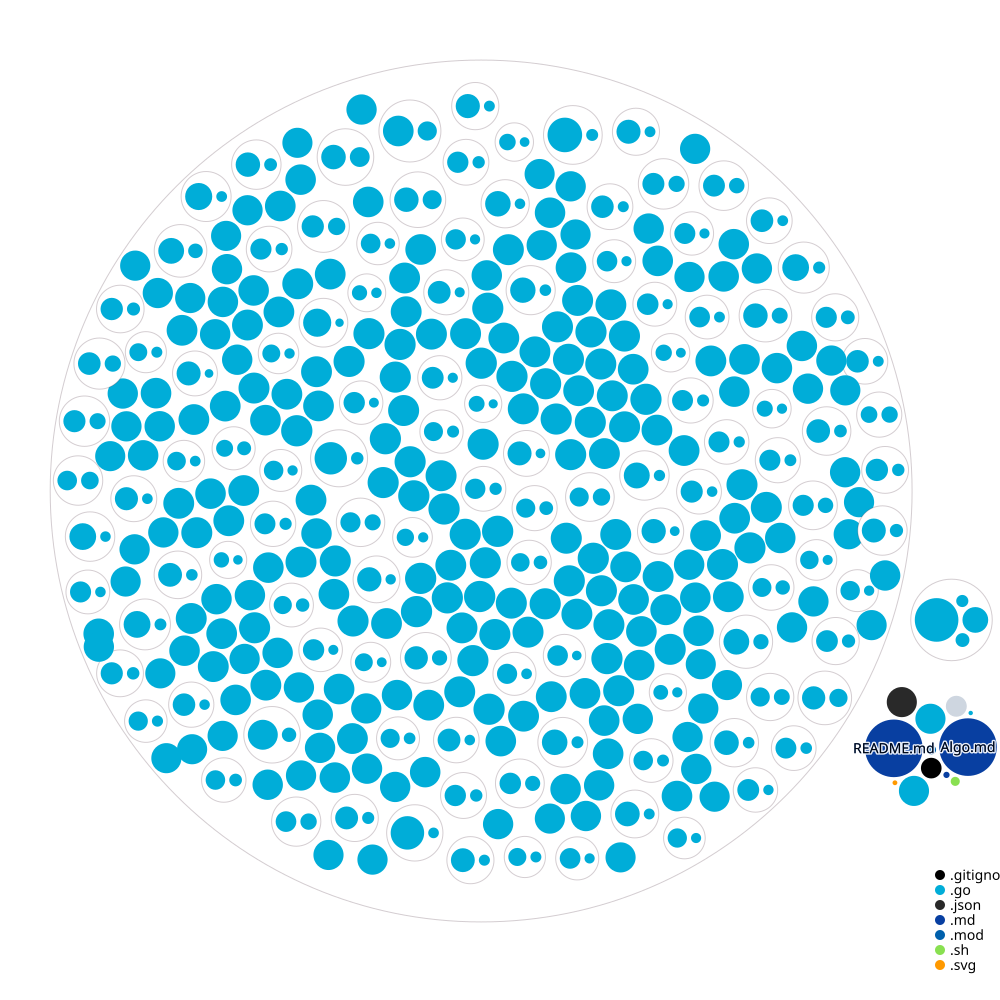

# leetcode-golang

```go
package main

import "fmt"

func main() {
  fmt.Println("Hello, leetcode")
}
```

# 文件结构

# 算法框架
See [Algo Overview](Algo.md)
# 提交总览
<!-- LEETCODE_TABLE_START -->
| 序号 | 题目 | 难度 | 解法 |
|------|------|------|------|
| 1 | [两数之和](https://leetcode.cn/problems/two-sum/description/) | Easy | 哈希，排序+双指针 |
| 2 | [两数相加](https://leetcode.cn/problems/add-two-numbers/description/) | Medium |  |
| 3 | [无重复字符的最长子串](https://leetcode.cn/problems/longest-substring-without-repeating-characters/description/) | Medium |  |
| 4 | [寻找两个正序数组的中位数](https://leetcode.cn/problems/median-of-two-sorted-arrays/description/) | Hard |  |
| 5 | [最长回文子串](https://leetcode.cn/problems/longest-palindromic-substring/description/) | Medium |  |
| 6 | [Z 字形变换](https://leetcode.cn/problems/zigzag-conversion/description/) | Medium |  |
| 8 | [字符串转换整数 (atoi)](https://leetcode.cn/problems/string-to-integer-atoi/description/) | Medium |  |
| 9 | [回文数](https://leetcode.cn/problems/palindrome-number/description/) | Easy |  |
| 10 | [正则表达式匹配](https://leetcode.cn/problems/regular-expression-matching/description/) | Hard |  |
| 11 | [盛最多水的容器](https://leetcode.cn/problems/container-with-most-water/description/) | Medium |  |
| 12 | [整数转罗马数字](https://leetcode.cn/problems/integer-to-roman/description/) | Medium |  |
| 13 | [罗马数字转整数]() | Easy |  |
| 14 | [最长公共前缀](https://leetcode.cn/problems/longest-common-prefix/description/) | Easy |  |
| 15 | [三数之和](https://leetcode.cn/problems/3sum/description/) | Medium |  |
| 16 | [最接近的三数之和](https://leetcode.cn/problems/3sum-closest/description/) | Medium |  |
| 17 | [电话号码的字母组合](https://leetcode.cn/problems/letter-combinations-of-a-phone-number/description/) | Medium |  |
| 18 | [四数之和](https://leetcode.cn/problems/4sum/description/) | Medium |  |
| 19 | [删除链表的倒数第 N 个结点](https://leetcode.cn/problems/remove-nth-node-from-end-of-list/description/) | Medium |  |
| 20 | [\n[10]\n612\n4\n5\n[3,6,8,11,5,10,4]\n[4,7,6,3,7,6,4]'](https://leetcode.cn/problems/meChtZ/description/) | Hard |  |
| 20 | [有效的括号](https://leetcode.cn/problems/valid-parentheses/description/) | Easy |  |
| 21 | [合并两个有序链表](https://leetcode.cn/problems/merge-two-sorted-lists/description/) | Easy |  |
| 22 | [括号生成](https://leetcode.cn/problems/generate-parentheses/description/) | Medium |  |
| 23 | [合并 K 个升序链表](https://leetcode.cn/problems/merge-k-sorted-lists/description/) | Hard |  |
| 24 | [两两交换链表中的节点](https://leetcode.cn/problems/swap-nodes-in-pairs/description/) | Medium |  |
| 25 | [K 个一组翻转链表](https://leetcode.cn/problems/reverse-nodes-in-k-group/description/) | Hard |  |
| 26 | [删除有序数组中的重复项](https://leetcode.cn/problems/remove-duplicates-from-sorted-array/description/) | Easy |  |
| 27 | [移除元素](https://leetcode.cn/problems/remove-element/description/) | Easy |  |
| 28 | [找出字符串中第一个匹配项的下标](https://leetcode.cn/problems/find-the-index-of-the-first-occurrence-in-a-string/description/) | Medium |  |
| 29 | [两数相除](https://leetcode.cn/problems/divide-two-integers/description/) | Medium |  |
| 30 | [串联所有单词的子串](https://leetcode.cn/problems/substring-with-concatenation-of-all-words/description/) | Hard |  |
| 31 | [下一个排列](https://leetcode.cn/problems/next-permutation/description/) | Medium |  |
| 32 | [最长有效括号](https://leetcode.cn/problems/longest-valid-parentheses/description/) | Hard |  |
| 33 | [搜索旋转排序数组](https://leetcode.cn/problems/search-in-rotated-sorted-array/description/) | Medium |  |
| 34 | [在排序数组中查找元素的第一个和最后一个位置](https://leetcode.cn/problems/find-first-and-last-position-of-element-in-sorted-array/description/) | Medium |  |
| 35 | [搜索插入位置](https://leetcode.cn/problems/search-insert-position/description/) | Easy |  |
| 36 | [有效的数独](https://leetcode.cn/problems/valid-sudoku/description/) | Medium |  |
| 37 | [解数独](https://leetcode.cn/problems/sudoku-solver/description/) | Hard |  |
| 39 | [组合总和](https://leetcode.cn/problems/combination-sum/description/) | Medium |  |
| 40 | [组合总和 II](https://leetcode.cn/problems/combination-sum-ii/description/) | Medium |  |
| 41 | [缺失的第一个正数](https://leetcode.cn/problems/first-missing-positive/description/) | Hard |  |
| 42 | [接雨水](https://leetcode.cn/problems/trapping-rain-water/description/) | Hard |  |
| 45 | [跳跃游戏 II](https://leetcode.cn/problems/jump-game-ii/description/) | Medium | 贪心 |
| 46 | [全排列](https://leetcode.cn/problems/permutations/description/) | Medium |  |
| 47 | [全排列 II](https://leetcode.cn/problems/permutations-ii/description/) | Medium |  |
| 48 | [旋转图像](https://leetcode.cn/problems/rotate-image/description/) | Medium |  |
| 49 | [字母异位词分组](https://leetcode.cn/problems/group-anagrams/description/) | Medium |  |
| 50 | [Pow(x, n)](https://leetcode.cn/problems/powx-n/description/) | Medium |  |
| 51 | [N 皇后](https://leetcode.cn/problems/n-queens/description/) | Hard |  |
| 52 | [N 皇后 II](https://leetcode.cn/problems/n-queens-ii/description/) | Hard |  |
| 53 | [最大子数组和](https://leetcode.cn/problems/maximum-subarray/description/) | Medium |  |
| 54 | [螺旋矩阵](https://leetcode.cn/problems/spiral-matrix/description/) | Medium |  |
| 55 | [跳跃游戏](https://leetcode.cn/problems/jump-game/description/) | Medium |  |
| 56 | [合并区间](https://leetcode.cn/problems/merge-intervals/description/) | Medium |  |
| 57 | [插入区间](https://leetcode.cn/problems/insert-interval/description/) | Medium |  |
| 58 | [最后一个单词的长度](https://leetcode.cn/problems/length-of-last-word/description/) | Easy |  |
| 59 | [螺旋矩阵 II](https://leetcode.cn/problems/spiral-matrix-ii/description/) | Medium |  |
| 60 | [排列序列](https://leetcode.cn/problems/permutation-sequence/description/) | Hard |  |
| 61 | [旋转链表](https://leetcode.cn/problems/rotate-list/description/) | Medium |  |
| 62 | [不同路径](https://leetcode.cn/problems/unique-paths/description/) | Medium |  |
| 63 | [不同路径 II](https://leetcode.cn/problems/unique-paths-ii/description/) | Medium |  |
| 64 | [最小路径和](https://leetcode.cn/problems/minimum-path-sum/description/) | Medium |  |
| 66 | [加一](https://leetcode.cn/problems/plus-one/description/) | Easy |  |
| 67 | [二进制求和](https://leetcode.cn/problems/add-binary/description/) | Easy |  |
| 68 | [文本左右对齐](https://leetcode.cn/problems/text-justification/description/) | Hard |  |
| 69 | [x 的平方根](https://leetcode.cn/problems/sqrtx/description/) | Easy |  |
| 70 | [爬楼梯](https://leetcode.cn/problems/climbing-stairs/description/) | Easy |  |
| 71 | [简化路径](https://leetcode.cn/problems/simplify-path/description/) | Medium |  |
| 72 | [编辑距离](https://leetcode.cn/problems/edit-distance/description/) | Medium |  |
| 73 | [矩阵置零](https://leetcode.cn/problems/set-matrix-zeroes/description/) | Medium |  |
| 74 | [搜索二维矩阵](https://leetcode.cn/problems/search-a-2d-matrix/description/) | Medium |  |
| 75 | [颜色分类](https://leetcode.cn/problems/sort-colors/description/) | Medium |  |
| 76 | [最小覆盖子串](https://leetcode.cn/problems/minimum-window-substring/description/) | Hard |  |
| 77 | [组合](https://leetcode.cn/problems/combinations/description/) | Medium |  |
| 78 | [子集](https://leetcode.cn/problems/subsets/description/) | Medium |  |
| 79 | [单词搜索](https://leetcode.cn/problems/word-search/description/) | Medium |  |
| 80 | [删除有序数组中的重复项 II](https://leetcode.cn/problems/remove-duplicates-from-sorted-array-ii/description/) | Medium |  |
| 82 | [删除排序链表中的重复元素 II](https://leetcode.cn/problems/remove-duplicates-from-sorted-list-ii/description/) | Medium |  |
| 83 | [删除排序链表中的重复元素](https://leetcode.cn/problems/remove-duplicates-from-sorted-list/description/) | Easy |  |
| 84 | [柱状图中最大的矩形](https://leetcode.cn/problems/largest-rectangle-in-histogram/description/) | Hard |  |
| 86 | [分隔链表](https://leetcode.cn/problems/partition-list/description/) | Medium |  |
| 88 | [合并两个有序数组](https://leetcode.cn/problems/merge-sorted-array/description/) | Easy |  |
| 90 | [子集 II](https://leetcode.cn/problems/subsets-ii/description/) | Medium |  |
| 92 | [反转链表 II](https://leetcode.cn/problems/reverse-linked-list-ii/description/) | Medium |  |
| 94 | [二叉树的中序遍历](https://leetcode.cn/problems/binary-tree-inorder-traversal/description/) | Easy |  |
| 95 | [不同的二叉搜索树 II](https://leetcode.cn/problems/unique-binary-search-trees-ii/description/) | Medium | 递归 |
| 96 | [不同的二叉搜索树](https://leetcode.cn/problems/unique-binary-search-trees/description/) | Medium |  |
| 97 | [交错字符串](https://leetcode.cn/problems/interleaving-string/description/) | Medium |  |
| 98 | [验证二叉搜索树](https://leetcode.cn/problems/validate-binary-search-tree/description/) | Medium |  |
| 100 | [相同的树](https://leetcode.cn/problems/same-tree/description/) | Easy |  |
| 101 | [对称二叉树](https://leetcode.cn/problems/symmetric-tree/description/) | Easy |  |
| 102 | [二叉树的层序遍历](https://leetcode.cn/problems/binary-tree-level-order-traversal/description/) | Medium |  |
| 103 | [二叉树的锯齿形层序遍历](https://leetcode.cn/problems/binary-tree-zigzag-level-order-traversal/description/) | Medium |  |
| 104 | [二叉树的最大深度](https://leetcode.cn/problems/maximum-depth-of-binary-tree/description/) | Easy |  |
| 105 | [从前序与中序遍历序列构造二叉树](https://leetcode.cn/problems/construct-binary-tree-from-preorder-and-inorder-traversal/description/) | Medium |  |
| 106 | [从中序与后序遍历序列构造二叉树](https://leetcode.cn/problems/construct-binary-tree-from-inorder-and-postorder-traversal/description/) | Medium |  |
| 108 | [将有序数组转换为二叉搜索树](https://leetcode.cn/problems/convert-sorted-array-to-binary-search-tree/description/) | Easy |  |
| 111 | [二叉树的最小深度](https://leetcode.cn/problems/minimum-depth-of-binary-tree/description/) | Easy |  |
| 112 | [路径总和](https://leetcode.cn/problems/path-sum/description/) | Easy |  |
| 113 | [路径总和 II](https://leetcode.cn/problems/path-sum-ii/description/) | Medium |  |
| 114 | [二叉树展开为链表](https://leetcode.cn/problems/flatten-binary-tree-to-linked-list/description/) | Medium |  |
| 115 | [不同的子序列](https://leetcode.cn/problems/distinct-subsequences/description/) | Hard |  |
| 116 | [填充每个节点的下一个右侧节点指针](https://leetcode.cn/problems/populating-next-right-pointers-in-each-node/description/) | Medium |  |
| 117 | [填充每个节点的下一个右侧节点指针 II](https://leetcode.cn/problems/populating-next-right-pointers-in-each-node-ii/description/) | Medium |  |
| 118 | [杨辉三角](https://leetcode.cn/problems/pascals-triangle/description/) | Easy |  |
| 120 | [三角形最小路径和](https://leetcode.cn/problems/triangle/description/) | Medium |  |
| 121 | [买卖股票的最佳时机](https://leetcode.cn/problems/best-time-to-buy-and-sell-stock/description/) | Easy |  |
| 122 | [买卖股票的最佳时机 II](https://leetcode.cn/problems/best-time-to-buy-and-sell-stock-ii/description/) | Medium |  |
| 123 | [买卖股票的最佳时机 III](https://leetcode.cn/problems/best-time-to-buy-and-sell-stock-iii/description/) | Hard |  |
| 124 | [二叉树中的最大路径和](https://leetcode.cn/problems/binary-tree-maximum-path-sum/description/) | Hard |  |
| 125 | [验证回文串](https://leetcode.cn/problems/valid-palindrome/description/) | Easy |  |
| 127 | [单词接龙](https://leetcode.cn/problems/word-ladder/description/) | Hard |  |
| 128 | [最长连续序列](https://leetcode.cn/problems/longest-consecutive-sequence/description/) | Medium |  |
| 129 | [求根节点到叶节点数字之和](https://leetcode.cn/problems/sum-root-to-leaf-numbers/description/) | Medium |  |
| 130 | [被围绕的区域](https://leetcode.cn/problems/surrounded-regions/description/) | Medium |  |
| 131 | [分割回文串](https://leetcode.cn/problems/palindrome-partitioning/description/) | Medium |  |
| 133 | [克隆图](https://leetcode.cn/problems/clone-graph/description/) | Medium |  |
| 134 | [加油站](https://leetcode.cn/problems/gas-station/description/) | Medium | 贪心 |
| 135 | [分发糖果](https://leetcode.cn/problems/candy/description/) | Hard | 贪心 |
| 136 | [只出现一次的数字](https://leetcode.cn/problems/single-number/description/) | Easy |  |
| 137 | [只出现一次的数字 II](https://leetcode.cn/problems/single-number-ii/description/) | Medium |  |
| 138 | [随机链表的复制](https://leetcode.cn/problems/copy-list-with-random-pointer/description/) | Medium |  |
| 139 | [单词拆分](https://leetcode.cn/problems/word-break/description/) | Medium |  |
| 140 | [单词拆分 II](https://leetcode.cn/problems/word-break-ii/description/) | Hard |  |
| 141 | [环形链表](https://leetcode.cn/problems/linked-list-cycle/description/) | Easy |  |
| 142 | [环形链表 II](https://leetcode.cn/problems/linked-list-cycle-ii/description/) | Medium |  |
| 144 | [二叉树的前序遍历](https://leetcode.cn/problems/binary-tree-preorder-traversal/description/) | Easy |  |
| 146 | [LRU 缓存](https://leetcode.cn/problems/lru-cache/description/) | Medium |  |
| 148 | [排序链表](https://leetcode.cn/problems/sort-list/description/) | Medium |  |
| 149 | [直线上最多的点数](https://leetcode.cn/problems/max-points-on-a-line/description/) | Hard |  |
| 150 | [逆波兰表达式求值](https://leetcode.cn/problems/evaluate-reverse-polish-notation/description/) | Medium |  |
| 151 | [反转字符串中的单词](https://leetcode.cn/problems/reverse-words-in-a-string/description/) | Medium |  |
| 152 | [乘积最大子数组](https://leetcode.cn/problems/maximum-product-subarray/description/) | Medium |  |
| 153 | [寻找旋转排序数组中的最小值](https://leetcode.cn/problems/find-minimum-in-rotated-sorted-array/description/) | Medium |  |
| 155 | [最小栈](https://leetcode.cn/problems/min-stack/description/) | Medium |  |
| 160 | [相交链表](https://leetcode.cn/problems/intersection-of-two-linked-lists/description/) | Easy |  |
| 162 | [寻找峰值](https://leetcode.cn/problems/find-peak-element/description/) | Medium |  |
| 167 | [两数之和 II - 输入有序数组](https://leetcode.cn/problems/two-sum-ii-input-array-is-sorted/description/) | Medium |  |
| 169 | [多数元素](https://leetcode.cn/problems/majority-element/description/) | Easy |  |
| 172 | [阶乘后的零](https://leetcode.cn/problems/factorial-trailing-zeroes/description/) | Medium |  |
| 173 | [二叉搜索树迭代器](https://leetcode.cn/problems/binary-search-tree-iterator/description/) | Medium |  |
| 174 | [地下城游戏](https://leetcode.cn/problems/dungeon-game/description/) | Hard |  |
| 187 | [重复的DNA序列](https://leetcode.cn/problems/repeated-dna-sequences/description/) | Medium |  |
| 188 | [买卖股票的最佳时机 IV](https://leetcode.cn/problems/best-time-to-buy-and-sell-stock-iv/description/) | Hard |  |
| 189 | [轮转数组](https://leetcode.cn/problems/rotate-array/description/) | Medium |  |
| 190 | [颠倒二进制位](https://leetcode.cn/problems/reverse-bits/description/) | Easy |  |
| 191 | [位1的个数](https://leetcode.cn/problems/number-of-1-bits/description/) | Easy |  |
| 198 | [打家劫舍](https://leetcode.cn/problems/house-robber/description/) | Medium |  |
| 199 | [二叉树的右视图](https://leetcode.cn/problems/binary-tree-right-side-view/description/) | Medium |  |
| 200 | [岛屿数量](https://leetcode.cn/problems/number-of-islands/description/) | Medium |  |
| 202 | [快乐数](https://leetcode.cn/problems/happy-number/description/) | Easy |  |
| 206 | [反转链表]() | Easy |  |
| 207 | [课程表](https://leetcode.cn/problems/course-schedule/description/) | Medium |  |
| 208 | [实现 Trie (前缀树)](https://leetcode.cn/problems/implement-trie-prefix-tree/description/) | Medium |  |
| 211 | [添加与搜索单词 - 数据结构设计](https://leetcode.cn/problems/design-add-and-search-words-data-structure/description/) | Medium |  |
| 212 | [单词搜索 II](https://leetcode.cn/problems/word-search-ii/description/) | Hard |  |
| 213 | [打家劫舍 II](https://leetcode.cn/problems/house-robber-ii/description/) | Medium |  |
| 215 | [数组中的第K个最大元素](https://leetcode.cn/problems/kth-largest-element-in-an-array/description/) | Medium |  |
| 221 | [最大正方形](https://leetcode.cn/problems/maximal-square/description/) | Medium |  |
| 222 | [完全二叉树的节点个数](https://leetcode.cn/problems/count-complete-tree-nodes/description/) | Medium |  |
| 225 | [用队列实现栈](https://leetcode.cn/problems/implement-stack-using-queues/description/) | Easy |  |
| 226 | [翻转二叉树](https://leetcode.cn/problems/invert-binary-tree/description/) | Easy |  |
| 230 | [二叉搜索树中第K小的元素](https://leetcode.cn/problems/kth-smallest-element-in-a-bst/description/) | Medium |  |
| 232 | [用栈实现队列](https://leetcode.cn/problems/implement-queue-using-stacks/description/) | Easy |  |
| 234 | [回文链表](https://leetcode.cn/problems/palindrome-linked-list/description/) | Easy |  |
| 235 | [二叉搜索树的最近公共祖先](https://leetcode.cn/problems/lowest-common-ancestor-of-a-binary-search-tree/description/) | Easy |  |
| 236 | [二叉树的最近公共祖先](https://leetcode.cn/problems/lowest-common-ancestor-of-a-binary-tree/description/) | Medium |  |
| 237 | [删除链表中的节点](https://leetcode.cn/problems/delete-node-in-a-linked-list/description/) | Easy |  |
| 239 | [滑动窗口最大值](https://leetcode.cn/problems/sliding-window-maximum/description/) | Hard |  |
| 240 | [搜索二维矩阵 II](https://leetcode.cn/problems/search-a-2d-matrix-ii/description/) | Medium |  |
| 258 | [各位相加](https://leetcode.cn/problems/add-digits/description/) | Easy |  |
| 268 | [丢失的数字](https://leetcode.cn/problems/missing-number/description/) | Easy |  |
| 279 | [完全平方数](https://leetcode.cn/problems/perfect-squares/description/) | Medium |  |
| 283 | [移动零](https://leetcode.cn/problems/move-zeroes/description/) | Easy |  |
| 287 | [寻找重复数](https://leetcode.cn/problems/find-the-duplicate-number/description/) | Medium |  |
| 295 | [数据流的中位数](https://leetcode.cn/problems/find-median-from-data-stream/description/) | Hard |  |
| 297 | [二叉树的序列化与反序列化](https://leetcode.cn/problems/serialize-and-deserialize-binary-tree/description/) | Hard |  |
| 300 | [最长递增子序列](https://leetcode.cn/problems/longest-increasing-subsequence/description/) | Medium |  |
| 303 | [区域和检索 - 数组不可变](https://leetcode.cn/problems/range-sum-query-immutable/description/) | Easy |  |
| 304 | [二维区域和检索 - 矩阵不可变](https://leetcode.cn/problems/range-sum-query-2d-immutable/description/) | Medium |  |
| 309 | [最佳买卖股票时机含冷冻期](https://leetcode.cn/problems/best-time-to-buy-and-sell-stock-with-cooldown/description/) | Medium |  |
| 312 | [戳气球](https://leetcode.cn/problems/burst-balloons/description/) | Hard |  |
| 315 | [计算右侧小于当前元素的个数](https://leetcode.cn/problems/count-of-smaller-numbers-after-self/description/) | Hard |  |
| 316 | [去除重复字母](https://leetcode.cn/problems/remove-duplicate-letters/description/) | Medium |  |
| 322 | [零钱兑换](https://leetcode.cn/problems/coin-change/description/) | Medium |  |
| 327 | [区间和的个数](https://leetcode.cn/problems/count-of-range-sum/description/) | Hard |  |
| 337 | [打家劫舍 III](https://leetcode.cn/problems/house-robber-iii/description/) | Medium | 递归 |
| 341 | [扁平化嵌套列表迭代器](https://leetcode.cn/problems/flatten-nested-list-iterator/description/) | Medium |  |
| 344 | [反转字符串](https://leetcode.cn/problems/reverse-string/description/) | Easy |  |
| 347 | [前 K 个高频元素](https://leetcode.cn/problems/top-k-frequent-elements/description/) | Medium |  |
| 354 | [俄罗斯套娃信封问题](https://leetcode.cn/problems/russian-doll-envelopes/description/) | Hard |  |
| 355 | [设计推特](https://leetcode.cn/problems/design-twitter/description/) | Medium |  |
| 380 | [O(1) 时间插入、删除和获取随机元素](https://leetcode.cn/problems/insert-delete-getrandom-o1/description/) | Medium |  |
| 387 | [字符串中的第一个唯一字符](https://leetcode.cn/problems/first-unique-character-in-a-string/description/) | Easy |  |
| 394 | [字符串解码](https://leetcode.cn/problems/decode-string/description/) | Medium |  |
| 416 | [分割等和子集](https://leetcode.cn/problems/partition-equal-subset-sum/description/) | Medium |  |
| 435 | [无重叠区间](https://leetcode.cn/problems/non-overlapping-intervals/description/) | Medium |  |
| 437 | [路径总和 III](https://leetcode.cn/problems/path-sum-iii/description/) | Medium | 前缀和 |
| 438 | [找到字符串中所有字母异位词](https://leetcode.cn/problems/find-all-anagrams-in-a-string/description/) | Medium |  |
| 450 | [删除二叉搜索树中的节点](https://leetcode.cn/problems/delete-node-in-a-bst/description/) | Medium |  |
| 451 | [根据字符出现频率排序](https://leetcode.cn/problems/sort-characters-by-frequency/description/) | Medium |  |
| 452 | [用最少数量的箭引爆气球](https://leetcode.cn/problems/minimum-number-of-arrows-to-burst-balloons/description/) | Medium |  |
| 460 | [LFU 缓存](https://leetcode.cn/problems/lfu-cache/description/) | Hard |  |
| 467 | [环绕字符串中唯一的子字符串](https://leetcode.cn/problems/unique-substrings-in-wraparound-string/description/) | Medium |  |
| 486 | [预测赢家](https://leetcode.cn/problems/predict-the-winner/description/) | Medium |  |
| 493 | [翻转对](https://leetcode.cn/problems/reverse-pairs/description/) | Hard |  |
| 494 | [目标和](https://leetcode.cn/problems/target-sum/description/) | Medium |  |
| 496 | [下一个更大元素 I](https://leetcode.cn/problems/next-greater-element-i/description/) | Easy |  |
| 503 | [下一个更大元素 II](https://leetcode.cn/problems/next-greater-element-ii/description/) | Medium |  |
| 509 | [斐波那契数](https://leetcode.cn/problems/fibonacci-number/description/) | Easy |  |
| 514 | [自由之路](https://leetcode.cn/problems/freedom-trail/description/) | Hard |  |
| 516 | [最长回文子序列](https://leetcode.cn/problems/longest-palindromic-subsequence/description/) | Medium |  |
| 518 | [零钱兑换 II](https://leetcode.cn/problems/coin-change-2/description/) | Medium |  |
| 528 | [按权重随机选择](https://leetcode.cn/problems/random-pick-with-weight/description/) | Medium |  |
| 530 | [二叉搜索树的最小绝对差](https://leetcode.cn/problems/minimum-absolute-difference-in-bst/description/) | Easy |  |
| 538 | [把二叉搜索树转换为累加树](https://leetcode.cn/problems/convert-bst-to-greater-tree/description/) | Medium |  |
| 543 | [二叉树的直径](https://leetcode.cn/problems/diameter-of-binary-tree/description/) | Easy |  |
| 560 | [和为 K 的子数组](https://leetcode.cn/problems/subarray-sum-equals-k/description/) | Medium |  |
| 567 | [字符串的排列](https://leetcode.cn/problems/permutation-in-string/description/) | Medium |  |
| 583 | [两个字符串的删除操作](https://leetcode.cn/problems/delete-operation-for-two-strings/description/) | Medium |  |
| 637 | [二叉树的层平均值](https://leetcode.cn/problems/average-of-levels-in-binary-tree/description/) | Easy |  |
| 648 | [单词替换](https://leetcode.cn/problems/replace-words/description/) | Medium |  |
| 652 | [寻找重复的子树](https://leetcode.cn/problems/find-duplicate-subtrees/description/) | Medium |  |
| 654 | [最大二叉树](https://leetcode.cn/problems/maximum-binary-tree/description/) | Medium |  |
| 662 | [二叉树最大宽度](https://leetcode.cn/problems/maximum-width-of-binary-tree/description/) | Medium | BFS |
| 669 | [修剪二叉搜索树](https://leetcode.cn/problems/trim-a-binary-search-tree/description/) | Medium |  |
| 677 | [键值映射](https://leetcode.cn/problems/map-sum-pairs/description/) | Medium |  |
| 692 | [前K个高频单词](https://leetcode.cn/problems/top-k-frequent-words/description/) | Medium |  |
| 695 | [岛屿的最大面积](https://leetcode.cn/problems/max-area-of-island/description/) | Medium |  |
| 698 | [划分为k个相等的子集](https://leetcode.cn/problems/partition-to-k-equal-sum-subsets/description/) | Medium |  |
| 700 | [二叉搜索树中的搜索](https://leetcode.cn/problems/search-in-a-binary-search-tree/description/) | Easy |  |
| 701 | [二叉搜索树中的插入操作](https://leetcode.cn/problems/insert-into-a-binary-search-tree/description/) | Medium |  |
| 703 | [数据流中的第 K 大元素](https://leetcode.cn/problems/kth-largest-element-in-a-stream/description/) | Easy |  |
| 704 | [二分查找](https://leetcode.cn/problems/binary-search/description/) | Easy |  |
| 710 | [黑名单中的随机数](https://leetcode.cn/problems/random-pick-with-blacklist/description/) | Hard |  |
| 712 | [两个字符串的最小ASCII删除和](https://leetcode.cn/problems/minimum-ascii-delete-sum-for-two-strings/description/) | Medium |  |
| 714 | [买卖股票的最佳时机含手续费](https://leetcode.cn/problems/best-time-to-buy-and-sell-stock-with-transaction-fee/description/) | Medium |  |
| 739 | [每日温度](https://leetcode.cn/problems/daily-temperatures/description/) | Medium |  |
| 752 | [打开转盘锁](https://leetcode.cn/problems/open-the-lock/description/) | Medium |  |
| 763 | [划分字母区间](https://leetcode.cn/problems/partition-labels/description/) | Medium |  |
| 769 | [最多能完成排序的块](https://leetcode.cn/problems/max-chunks-to-make-sorted/description/) | Medium |  |
| 773 | [滑动谜题](https://leetcode.cn/problems/sliding-puzzle/description/) | Hard |  |
| 779 | [第K个语法符号](https://leetcode.cn/problems/k-th-symbol-in-grammar/description/) | Medium |  |
| 787 | [K 站中转内最便宜的航班](https://leetcode.cn/problems/cheapest-flights-within-k-stops/description/) | Medium |  |
| 797 | [所有可能的路径](https://leetcode.cn/problems/all-paths-from-source-to-target/description/) | Medium | 递归 |
| 801 | [使序列递增的最小交换次数](https://leetcode.cn/problems/minimum-swaps-to-make-sequences-increasing/description/) | Hard |  |
| 811 | [子域名访问计数](https://leetcode.cn/problems/subdomain-visit-count/description/) | Medium |  |
| 817 | [链表组件](https://leetcode.cn/problems/linked-list-components/description/) | Medium |  |
| 823 | [带因子的二叉树](https://leetcode.cn/problems/binary-trees-with-factors/description/) | Medium |  |
| 856 | [括号的分数](https://leetcode.cn/problems/score-of-parentheses/description/) | Medium |  |
| 870 | [优势洗牌](https://leetcode.cn/problems/advantage-shuffle/description/) | Medium |  |
| 876 | [链表的中间结点](https://leetcode.cn/problems/middle-of-the-linked-list/description/) | Easy |  |
| 877 | [石子游戏](https://leetcode.cn/problems/stone-game/description/) | Medium |  |
| 886 | [可能的二分法](https://leetcode.cn/problems/possible-bipartition/description/) | Medium |  |
| 887 | [鸡蛋掉落](https://leetcode.cn/problems/super-egg-drop/description/) | Hard |  |
| 889 | [根据前序和后序遍历构造二叉树](https://leetcode.cn/problems/construct-binary-tree-from-preorder-and-postorder-traversal/description/) | Medium |  |
| 901 | [股票价格跨度](https://leetcode.cn/problems/online-stock-span/description/) | Medium |  |
| 902 | [最大为 N 的数字组合](https://leetcode.cn/problems/numbers-at-most-n-given-digit-set/description/) | Hard |  |
| 904 | [水果成篮](https://leetcode.cn/problems/fruit-into-baskets/description/) | Medium |  |
| 912 | [排序数组](https://leetcode.cn/problems/sort-an-array/description/) | Medium |  |
| 927 | [三等分](https://leetcode.cn/problems/three-equal-parts/description/) | Hard |  |
| 931 | [下降路径最小和](https://leetcode.cn/problems/minimum-falling-path-sum/description/) | Medium |  |
| 940 | [不同的子序列 II](https://leetcode.cn/problems/distinct-subsequences-ii/description/) | Hard |  |
| 954 | [二倍数对数组](https://leetcode.cn/problems/array-of-doubled-pairs/description/) | Medium |  |
| 961 | [在长度 2N 的数组中找出重复 N 次的元素](https://leetcode.cn/problems/n-repeated-element-in-size-2n-array/description/) | Easy |  |
| 994 | [腐烂的橘子](https://leetcode.cn/problems/rotting-oranges/description/) | Medium |  |
| 1020 | [飞地的数量](https://leetcode.cn/problems/number-of-enclaves/description/) | Medium |  |
| 1023 | [驼峰式匹配](https://leetcode.cn/problems/camelcase-matching/description/) | Medium |  |
| 1024 | [视频拼接](https://leetcode.cn/problems/video-stitching/description/) | Medium |  |
| 1032 | [字符流](https://leetcode.cn/problems/stream-of-characters/description/) | Hard |  |
| 1038 | [从二叉搜索树到更大和树](https://leetcode.cn/problems/binary-search-tree-to-greater-sum-tree/description/) | Medium |  |
| 1041 | [困于环中的机器人](https://leetcode.cn/problems/robot-bounded-in-circle/description/) | Medium |  |
| 1053 | [交换一次的先前排列](https://leetcode.cn/problems/previous-permutation-with-one-swap/description/) | Medium | 贪心 |
| 1081 | [不同字符的最小子序列](https://leetcode.cn/problems/smallest-subsequence-of-distinct-characters/description/) | Medium |  |
| 1094 | [拼车](https://leetcode.cn/problems/car-pooling/description/) | Medium |  |
| 1104 | [二叉树寻路](https://leetcode.cn/problems/path-in-zigzag-labelled-binary-tree/description/) | Medium | 二叉堆 |
| 1109 | [航班预订统计](https://leetcode.cn/problems/corporate-flight-bookings/description/) | Medium |  |
| 1143 | [最长公共子序列](https://leetcode.cn/problems/longest-common-subsequence/description/) | Medium |  |
| 1147 | [段式回文](https://leetcode.cn/problems/longest-chunked-palindrome-decomposition/description/) | Hard | 贪心 |
| 1175 | [质数排列](https://leetcode.cn/problems/prime-arrangements/description/) | Easy |  |
| 1235 | [规划兼职工作](https://leetcode.cn/problems/maximum-profit-in-job-scheduling/description/) | Hard | 动态规划 |
| 1254 | [统计封闭岛屿的数目](https://leetcode.cn/problems/number-of-closed-islands/description/) | Medium |  |
| 1267 | [统计参与通信的服务器](https://leetcode.cn/problems/count-servers-that-communicate/description/) | Medium |  |
| 1290 | [二进制链表转整数](https://leetcode.cn/problems/convert-binary-number-in-a-linked-list-to-integer/description/) | Easy |  |
| 1312 | [让字符串成为回文串的最少插入次数](https://leetcode.cn/problems/minimum-insertion-steps-to-make-a-string-palindrome/description/) | Hard |  |
| 1390 | [四因数](https://leetcode.cn/problems/four-divisors/description/) | Medium |  |
| 1441 | [用栈操作构建数组](https://leetcode.cn/problems/build-an-array-with-stack-operations/description/) | Medium |  |
| 1547 | [切棍子的最小成本](https://leetcode.cn/problems/minimum-cost-to-cut-a-stick/description/) | Hard |  |
| 1616 | [分割两个字符串得到回文串](https://leetcode.cn/problems/split-two-strings-to-make-palindrome/description/) | Medium |  |
| 1625 | [执行操作后字典序最小的字符串](https://leetcode.cn/problems/lexicographically-smallest-string-after-applying-operations/description/) | Medium | BFS |
| 1626 | [无矛盾的最佳球队](https://leetcode.cn/problems/best-team-with-no-conflicts/description/) | Medium |  |
| 1630 | [等差子数组](https://leetcode.cn/problems/arithmetic-subarrays/description/) | Medium |  |
| 1641 | [统计字典序元音字符串的数目](https://leetcode.cn/problems/count-sorted-vowel-strings/description/) | Medium |  |
| 1700 | [无法吃午餐的学生数量](https://leetcode.cn/problems/number-of-students-unable-to-eat-lunch/description/) | Easy |  |
| 1705 | [吃苹果的最大数目](https://leetcode.cn/problems/maximum-number-of-eaten-apples/description/) | Medium |  |
| 1790 | [仅执行一次字符串交换能否使两个字符串相等](https://leetcode.cn/problems/check-if-one-string-swap-can-make-strings-equal/description/) | Easy |  |
| 1800 | [最大升序子数组和](https://leetcode.cn/problems/maximum-ascending-subarray-sum/description/) | Easy |  |
| 1802 | [有界数组中指定下标处的最大值](https://leetcode.cn/problems/maximum-value-at-a-given-index-in-a-bounded-array/description/) | Medium |  |
| 1803 | [统计异或值在范围内的数对有多少](https://leetcode.cn/problems/count-pairs-with-xor-in-a-range/description/) | Hard |  |
| 1845 | [座位预约管理系统](https://leetcode.cn/problems/seat-reservation-manager/description/) | Medium |  |
| 1884 | [鸡蛋掉落-两枚鸡蛋](https://leetcode.cn/problems/egg-drop-with-2-eggs-and-n-floors/description/) | Medium |  |
| 1905 | [统计子岛屿](https://leetcode.cn/problems/count-sub-islands/description/) | Medium |  |
| 1975 | [最大方阵和](https://leetcode.cn/problems/maximum-matrix-sum/description/) | Medium |  |
| 2037 | [使每位学生都有座位的最少移动次数](https://leetcode.cn/problems/minimum-number-of-moves-to-seat-everyone/description/) | Easy |  |
| 2042 | [检查句子中的数字是否递增](https://leetcode.cn/problems/check-if-numbers-are-ascending-in-a-sentence/description/) | Easy |  |
| 2110 | [股票平滑下跌阶段的数目](https://leetcode.cn/problems/number-of-smooth-descent-periods-of-a-stock/description/) | Medium |  |
| 2180 | [统计各位数字之和为偶数的整数个数](https://leetcode.cn/problems/count-integers-with-even-digit-sum/description/) | Easy |  |
| 2404 | [出现最频繁的偶数元素](https://leetcode.cn/problems/most-frequent-even-element/description/) | Easy |  |
| 2409 | [统计共同度过的日子数](https://leetcode.cn/problems/count-days-spent-together/description/) | Easy |  |
| 2410 | [运动员和训练师的最大匹配数](https://leetcode.cn/problems/maximum-matching-of-players-with-trainers/description/) | Medium |  |
| 2411 | [按位或最大的最小子数组长度](https://leetcode.cn/problems/smallest-subarrays-with-maximum-bitwise-or/description/) | Medium |  |
| 2412 | [完成所有交易的初始最少钱数](https://leetcode.cn/problems/minimum-money-required-before-transactions/description/) | Hard |  |
| 2413 | [最小偶倍数](https://leetcode.cn/problems/smallest-even-multiple/description/) | Easy |  |
| 2414 | [最长的字母序连续子字符串的长度](https://leetcode.cn/problems/length-of-the-longest-alphabetical-continuous-substring/description/) | Medium |  |
| 2415 | [反转二叉树的奇数层](https://leetcode.cn/problems/reverse-odd-levels-of-binary-tree/description/) | Medium |  |
| 2416 | [字符串的前缀分数和](https://leetcode.cn/problems/sum-of-prefix-scores-of-strings/description/) | Hard |  |
| 2455 | [可被三整除的偶数的平均值](https://leetcode.cn/problems/average-value-of-even-numbers-that-are-divisible-by-three/description/) | Easy |  |
| 2456 | [最流行的视频创作者](https://leetcode.cn/problems/most-popular-video-creator/description/) | Medium |  |
| 2457 | [美丽整数的最小增量](https://leetcode.cn/problems/minimum-addition-to-make-integer-beautiful/description/) | Medium | 贪心 |
| 2458 | [移除子树后的二叉树高度](https://leetcode.cn/problems/height-of-binary-tree-after-subtree-removal-queries/description/) | Hard |  |
| 2469 | [温度转换](https://leetcode.cn/problems/convert-the-temperature/description/) | Easy |  |
| 2679 | [矩阵中的和](https://leetcode.cn/problems/sum-in-a-matrix/description/) | Medium |  |
| 2828 | [判别首字母缩略词](https://leetcode.cn/problems/check-if-a-string-is-an-acronym-of-words/description/) | Easy |  |
| 2931 | [购买物品的最大开销](https://leetcode.cn/problems/maximum-spending-after-buying-items/description/) | Hard |  |
| 2998 | [使 X 和 Y 相等的最少操作次数](https://leetcode.cn/problems/minimum-number-of-operations-to-make-x-and-y-equal/description/) | Medium |  |
| 3258 | [统计满足 K 约束的子字符串数量 I](https://leetcode.cn/problems/count-substrings-that-satisfy-k-constraint-i/description/) | Easy |  |
| 3264 | [K 次乘运算后的最终数组 I](https://leetcode.cn/problems/final-array-state-after-k-multiplication-operations-i/description/) | Easy |  |
| 3266 | [K 次乘运算后的最终数组 II](https://leetcode.cn/problems/final-array-state-after-k-multiplication-operations-ii/description/) | Hard |  |
| 3573 | [买卖股票的最佳时机 V](https://leetcode.cn/problems/best-time-to-buy-and-sell-stock-v/description/) | Medium |  |
| 3652 | [按策略买卖股票的最佳时机](https://leetcode.cn/problems/best-time-to-buy-and-sell-stock-using-strategy/description/) | Medium |  |

<!-- LEETCODE_TABLE_END -->
